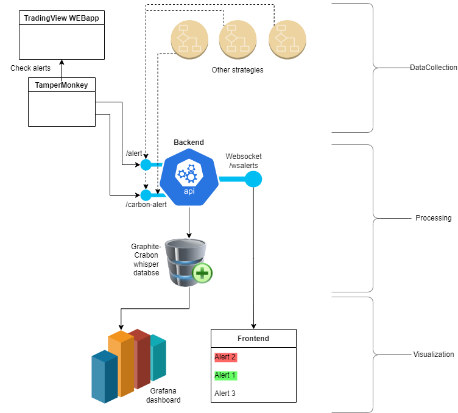

# TvTrader fullstack

[](https://sonarcloud.io/summary/new_code?id=dzooli_tvtrader)

## Description

This is a full stack Sanic+Vue application for easily collect and process TradingView alerts.

__Do not use in production__ as it is created for learning and personal use only. __No authentication__ is implemented yet.

## Overview



## Features

- Receive alerts via custom scripts injected to TradingView using TamperMonkey
- Forward received alerts to the connected websocket clients
- Forward received alerts to a Graphite RRD for further processing (for example in Grafana)
- Display latest alerts on the Web UI
- Easy connection of external trading strategy alerts
- REST API (start the backend and go to [http://localhost:8089/swagger] for details)

### Example Grafana dashboard


## Stack

- Sanic for the backend
- Vue with Vuex and Vuetify for the frontend
- Docker for containerization (coming soon)

## Installation

Clone the repository and change the current directory to it.

```bash
git clone https://github.com/dzooli/tvtrader.git
cd tvtrader
```

### Backend

Using a __Linux__ environment:

```bash
python -m venv .
source bin/activate
pip install -r requirements.txt
```

#### Start backend

```bash
cd backend
./start.sh
```

```bash
# or after manual venv activation
python -m src.server
```

Under Windows the virtualenv creates a different directory structure and activation will also be different. Please read the virtualenv related documentation first.

### Frontend

```bash
cd frontend
npm -g i yarn
yarn install
```

#### Start frontend

```bash
cd frontend
yarn serve # For development. Use 'yarn build' for production use and deploy it in your preferred way.
```

## Usage

### Alert catching setup

Install TamperMonkey Chrome extension and add the scripts from the ```scripts``` directory. Restrict them to run only on ```https://tradingview.com/charts/*``` on the settings page and __do other security related settings as you wish.__ Do not forget, TamperMonkey is a powerful but double-edged tool.

Open TradingView, login and display the alerts panel. Add a properly formatted alert following the directions below.

### TradingView alert setup

#### General rules

- Do not add blocking pop-up window
- Do not add disturbing actions
- Use the strategy.comment as "BUY" or "SELL" only
- Keep the Alerts panel open (the page script is based on this panel)

#### Alert message content

```json
{
    "stratId":1,
    "stratName":"STARTNAME1",
    "symbol": "{{exchange}}:{{ticker}}",
    "interval":{{interval}},
    "direction":"{{strategy.order.comment}}",
    "timestamp": "{{timenow}}"
}
```

#### Example settings


### Enjoy

 Start the backend first and the frontend. Open the frontend with your browser on [http://localhost:8080/] and wait for the alerts.

## Extras

In the ```doc``` folder you can find a Grafana dashboard example JSON file directly exported from my working setup.
