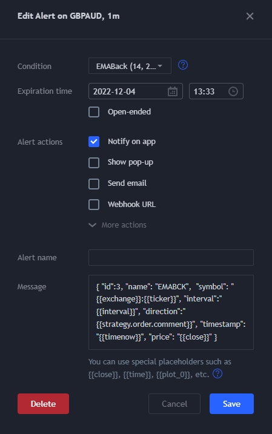

# TvTrader fullstack

[](https://sonarcloud.io/summary/new_code?id=dzooli_tvtrader)
[](https://sonarcloud.io/summary/new_code?id=dzooli_tvtrader) [](https://sonarcloud.io/summary/new_code?id=dzooli_tvtrader)

## Description

This is a full stack Sanic+Vue application for easily collect and process TradingView alerts and possibly execute custom tradin strategies. Includes a modular alert distribution layer in the ```agents``` directory.

Also a good candidate to learn more about test automation. **Pytest-BDD** is used for test automation, see the `tests` folder for examples.

**Do not use in production** as it is created for learning and personal use only. **No authentication** is implemented yet.

## Overview

[_C4_diagram_here_]

```plantuml
@startuml C4_Elements
!include doc/C4-PlantUML/C4_Container.puml

LAYOUT_WITH_LEGEND()

AddElementTag("dev", $fontColor="yellow")
AddRelTag("future", $textColor="lightgrey", $lineColor="grey", $lineStyle = DashedLine())
Person(user, "Users")

System_Ext(tradingview, "TradingView", "Data source")
Container(tvtrader_frontend, "Frontend", "VueJs", "Alert dashboard")

System_Boundary(data_backend, "Data Backend") {
  Container(fetcher, "Fetcher", "REST, NestJs", "Allows users to dinamycally fetch price data from TradingView")
  SystemDb(influx, "Store", "InfluxDB, FluxScript")
  Container(tvtrader_backend, "Backend", "WS, REST", "API backend for the dashboard")
  Container(tvtrader_distributor, "Distributor", "Python", "Receiver and distributor for the alerts")
}
SystemQueue(alertq, "Alert Queue")

System_Boundary(dist_targets, "Distribution Targets") {
  Person(sysdev, "Target developer", $tags="dev")
  Container(carbon, "CarbonDB", "Optional target for the alerts")
  Container(grafana, "Grafana", "Optional target for the alerts")
  Container(logging, "Logging", "Optional loogging for the alerts")
  Container(opt_target, "...", "Other types of distribution targets")
  Container_Ext(future_frontend, "Future Frontend", "Vue3+Quasar")
  Rel_D(sysdev, opt_target, "Implements distribution targets")
  Rel_U(sysdev, carbon, "Implements distribution targets")
  Rel_L(sysdev, grafana, "Implements distribution targets")
  Rel_R(sysdev, logging, "Implements distribution targets")
  Rel_U(sysdev, future_frontend, "Implements features", $tags="future")
}

System_Boundary(strategies, "Strategy evaluators") {
  Container(strategy_1, "Jupyter", "NumPy, Pandas", "Evaluator for the strategy")
  Container(opt_strategy, "Others", "Various technologies", "Additional evaluators")
  Person(quant, "Quantitative Developer", $tags="dev")
  System_Boundary(browser, "Browser") {
    Container_Ext(tvui, "TradingView UI", "User interface for TradingView")
    Container(alertmonitor, "Monitoring script", "Monitor for the alert panel")
    Container(monkey, "TamperMonkey plugin", "Executor")
    Rel_D(monkey, alertmonitor, "Injects and executes the script")
    Rel(tvui, alertmonitor, "Provides alerts")
    Rel(tradingview, tvui, "Sends prices, executes PineScript strategies")
  }

}

Rel(tvtrader_distributor, alertq, "Distributes the alerts", "ThreadPool")
Rel(alertq, dist_targets, "Receives and processes the alerts")

Rel(tradingview, fetcher, "Fetches prices", "HTTPS GET")
Rel(fetcher, influx, "Gets specific prices periodaically", "REST GET")
Rel_R(influx, strategies, "Reads the prices and calculates the strategy action", "API")
Rel_U(strategies, tvtrader_backend, "Sends strategy alerts", "REST POST")
Rel_R(tvtrader_backend, tvtrader_frontend, "Receives alerts for visualization", "WebSocket")
Rel(tvtrader_backend, tvtrader_distributor, "Receives alerts for distribution", "WebSocket")
Rel_U(user, tvtrader_frontend, "Monitors the alerts")
Rel_U(user, future_frontend, "Monitors the alerts", $tags="future")
Rel_U(quant, opt_strategy, "Implements new strategies")
Rel_U(quant, strategy_1, "Implements new strategies")
@enduml
```


## Features

- Receives alerts via custom scripts injected to TradingView using TamperMonkey
- Forwards received alerts to the connected websocket clients
- Forwards received alerts to a Graphite RRD for further processing (for example in Grafana)
- Displays latest alerts on the Web UI
- Easy connection of external trading strategy alerts
- REST API (start the backend and go to [http://localhost:8089/swagger] for details)

### Distributor features

- Use Websocket as a source (an usable websocket is included in the backend)
- Use dynamically loaded distribution targets
  - Example console target implementation is included with CLI
  - More is on way

### Example Grafana dashboard


## Stack

- Sanic for the backend
- Vue with Vuex and Vuetify for the frontend
- Docker for containerization (coming soon)

## Installation

Clone the repository and change the current directory to it.

```bash
git clone https://github.com/dzooli/tvtrader.git
cd tvtrader
```

### Testing

Use the requirements_dev.txt for virtualenv creation:

```bash
python -m venv .
source venv/bin/activate
pip install -r backend/requirements.txt
pip install -r backend/requirements_dev.txt
pytest backend
pytest agents/tvt_agents
```

### Backend

Using a **Linux** environment:

```bash
python -m venv .
source bin/activate
pip install -r requirements.txt
```

#### Start backend

```bash
cd backend
./start.sh
```

```bash
# or after manual venv activation
python -m src.server
```

Under Windows the virtualenv creates a different directory structure and activation will also be different. Please read the virtualenv related documentation first.

### Frontend

```bash
cd frontend
npm -g i yarn
yarn install
```

#### Start frontend

```bash
cd frontend
yarn serve # For development. Use 'yarn build' for production use and deploy it in your preferred way.
```

## Usage

### Alert catching setup

Install TamperMonkey Chrome extension and add the scripts from the `scripts` directory. Restrict them to run only on `https://tradingview.com/charts/*` on the settings page and **do other security related settings as you wish.** Do not forget, TamperMonkey is a powerful but double-edged tool.

Open TradingView, login and display the alerts panel. Add a properly formatted alert following the directions below.

### TradingView alert setup

#### General rules

- Do not add blocking pop-up window
- Do not add disturbing actions
- Use the strategy.comment as "BUY" or "SELL" only
- Keep the Alerts panel open (the page script is based on this panel)

#### Alert message content

```json
{
    "stratId":1,
    "stratName":"STARTNAME1",
    "symbol": "{{exchange}}:{{ticker}}",
    "interval":{{interval}},
    "direction":"{{strategy.order.comment}}",
    "timestamp": "{{timenow}}"
}
```

#### Example settings



### Enjoy

Start the backend first and the frontend. Open the frontend with your browser on [http://localhost:8080/] and wait for the alerts.

## Extras

In the `doc` folder you can find a Grafana dashboard example JSON file directly exported from my working setup.
